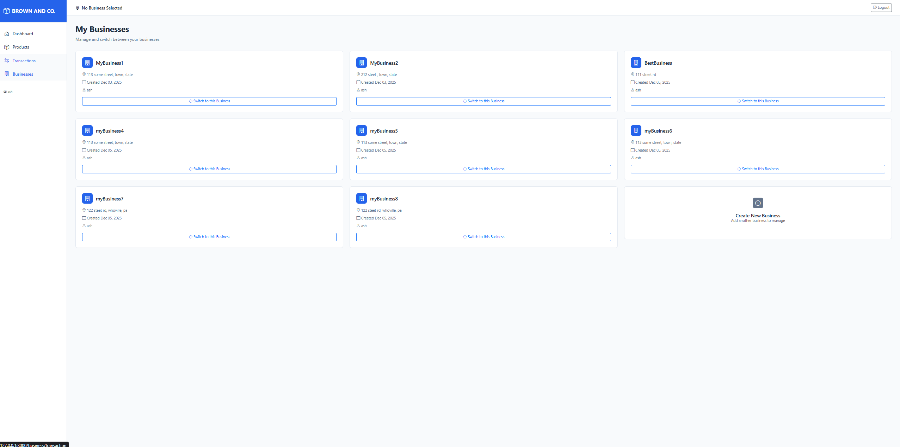
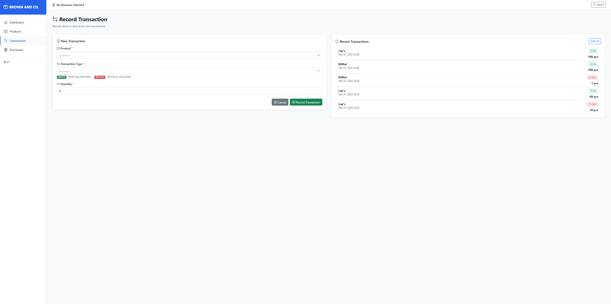
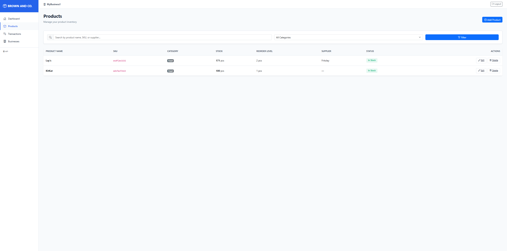
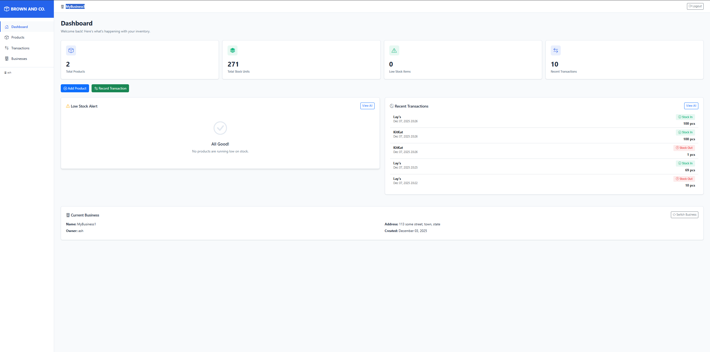

# Inventory Management System




A modern, multi-business inventory management SaaS application built with Django and Bootstrap 5.


## Features

### Multi-Business Management
- Create and manage multiple businesses under one account
- Switch between businesses seamlessly
- Each business has isolated inventory

### Product Management
- Add, update, and delete products
- Track SKU, category, supplier information
- Set reorder levels for low stock alerts
- Search and filter products by name, SKU, or category

### Stock Tracking
- Record stock in and stock out transactions
- Real-time quantity updates
- Transaction history for each product
- Prevent negative stock levels

### Dashboard
- Overview of total products and stock levels
- Low stock alerts with color-coded badges
- Recent transaction timeline
- Quick action buttons

### Modern UI/UX
- Responsive sidebar navigation
- Mobile-friendly design
- Card-based layout
- Color-coded status indicators
- Empty state messages
- Professional authentication pages

## Tech Stack

- **Backend:** Django 5.2.9
- **Database:** SQLite3
- **Frontend:** Django Templates + Bootstrap 5.3.0
- **Icons:** Bootstrap Icons 1.11.0
- **JavaScript:** Vanilla JS (no frameworks)

## Installation

### Prerequisites
- Python 3.8 or higher
- pip package manager

### Setup

1. **Clone the repository**
   ```bash
   git clone <repository-url>
   cd Inventory-management
   ```

2. **Create a virtual environment**
   ```bash
   python -m venv venv
   ```

3. **Activate the virtual environment**
   - Windows:
     ```bash
     venv\Scripts\activate
     ```
   - Mac/Linux:
     ```bash
     source venv/bin/activate
     ```

4. **Install dependencies**
   ```bash
   pip install django
   ```

5. **Navigate to project directory**
   ```bash
   cd micro_SaaS
   ```

6. **Run migrations**
   ```bash
   python manage.py migrate
   ```

7. **Create a superuser (optional)**
   ```bash
   python manage.py createsuperuser
   ```

8. **Start the development server**
   ```bash
   python manage.py runserver
   ```

9. **Access the application**
   Open your browser and navigate to: `http://127.0.0.1:8000`

## Usage

### First Time Setup

1. **Sign Up**
   - Navigate to the signup page
   - Create an account with your details

2. **Create a Business**
   - After login, you'll be prompted to create your first business
   - Enter business name and address

3. **Add Products**
   - Go to Products section from the sidebar
   - Click "Add Product"
   - Fill in product details (name, SKU, category, quantity, reorder level, unit)

4. **Record Transactions**
   - Click "Record Transaction" from dashboard or sidebar
   - Select a product
   - Choose transaction type (Stock In/Stock Out)
   - Enter quantity

### Managing Multiple Businesses

- Click on the business name in the top header
- Go to "Businesses" in the sidebar
- Create new businesses or switch between existing ones

## Project Structure

```
Inventory-management/
├── micro_SaaS/                    # Django project root
│   ├── manage.py                  # Django management script
│   ├── db.sqlite3                 # SQLite database
│   ├── micro_SaaS/                # Project configuration
│   │   ├── settings.py
│   │   ├── urls.py
│   │   └── wsgi.py
│   └── inventory/                 # Main Django app
│       ├── models.py              # Database models
│       ├── views.py               # View logic
│       ├── forms.py               # Django forms
│       ├── urls.py                # URL routing
│       ├── static/                # Static files
│       │   └── inventory/
│       │       ├── css/
│       │       │   └── style.css  # Custom styles
│       │       └── js/
│       │           └── main.js    # JavaScript interactions
│       └── templates/             # HTML templates
│           └── inventory/
│               ├── base.html
│               ├── dashboard.html
│               ├── product_*.html
│               ├── business_*.html
│               ├── transaction_*.html
│               ├── login.html
│               └── signup.html
└── README.md
```

## Database Models

### Business
- Multi-tenant support
- Each user can own multiple businesses
- Fields: name, address, owner, created_at

### Product
- Belongs to a business
- Fields: name, sku, category, current_quantity, reorder_level, unit, supplier_name
- Unique constraints on (business, name) and (business, sku)

### StockTransaction
- Records stock movements
- Fields: product, business, type (In/Out), quantity, created_at
- Automatically updates product quantity

## Features Roadmap

- [ ] Export functionality (CSV/Excel/PDF)
- [ ] Advanced reporting and analytics
- [ ] Multi-user collaboration per business
- [ ] Email notifications for low stock
- [ ] Barcode/QR code support
- [ ] Mobile app
- [ ] API endpoints (REST/GraphQL)

## Development

### Running Tests
```bash
python manage.py test
```

### Collecting Static Files (for production)
```bash
python manage.py collectstatic
```

### Creating Migrations
```bash
python manage.py makemigrations
python manage.py migrate
```

## Security Notes

⚠️ **Important:** This is a development setup. For production deployment:

1. Set `DEBUG = False` in settings.py
2. Change `SECRET_KEY` to a secure random value
3. Configure `ALLOWED_HOSTS`
4. Use a production database (PostgreSQL recommended)
5. Set up proper static file serving
6. Enable HTTPS
7. Configure email backend for notifications
8. Set up proper backup strategies

## Contributing

Contributions are welcome! Please feel free to submit a Pull Request.

## License

This project is open source and available under the [MIT License](LICENSE).

## Support

For issues, questions, or suggestions, please open an issue on the GitHub repository.

## Acknowledgments

- Built with [Django](https://www.djangoproject.com/)
- UI powered by [Bootstrap 5](https://getbootstrap.com/)
- Icons from [Bootstrap Icons](https://icons.getbootstrap.com/)

---


